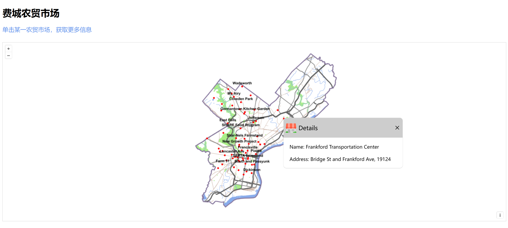

# Github地址

https://github.com/moonlight216/WebGIS10-11

# 实践10

1. 使用`OpenLayers v8.1.0`复现了课本上的例子。

2. 重新设计了**信息弹窗**的样式，更加美观。

3. 课本上的例子在点击其它地方时，已经存在的信息弹窗不会消失，对此我进行了一些改动：当点击其它地方之后原弹窗会自动消失，或者点击弹窗上的关闭按钮自行关闭。

**主要修改了以下代码：**

```javascript
map.on('click', e => {
    var url = wmsLayer.getSource().getFeatureInfoUrl(
        e.coordinate, map.getView().getResolution(), toProjection,
        { 'INFO_FORMAT': 'application/json' }
    );
    fetch(url)
        .then(response => {
            return response.json();
        })
        .then(json => {
            var features = json.features;
            console.log(json)
            if (features != null) {
                if (features.length !== 0) {
                    //点击在WMS图层的点上时
                    var properties = features[0].properties;
                    info_content.innerText = 
                        "Name: " + properties.NAME + '\n' + '\n' + "Address: " + properties.ADDRESS;
                    info.setPosition(e.coordinate);
                } else {
                    info.setPosition(undefined);
                }
            }
        })
});
```



# 实践11

使用`OpenLayers v8.1.0`复现了课本上的例子。


**主要修改了以下代码：**

```javascript
//改变<p>标签内容
map.on('click', e => {
    var pixel = map.getEventPixel(e.originalEvent);
    let flag = true;//点击在要素点上为false
    map.forEachFeatureAtPixel(pixel, feature => {
        var featureName = feature.getProperties().name || "无名称要素";
        console.log()
        document.getElementById('docs').innerHTML = '<p style="font-size:18px"><b>' + featureName + '</b></p>';
        flag = false;
    });
    if (flag) {
        document.getElementById('docs').innerHTML = '<p>点击地图中的公园或食品店获取更多信息</p>';
    }
});
```

